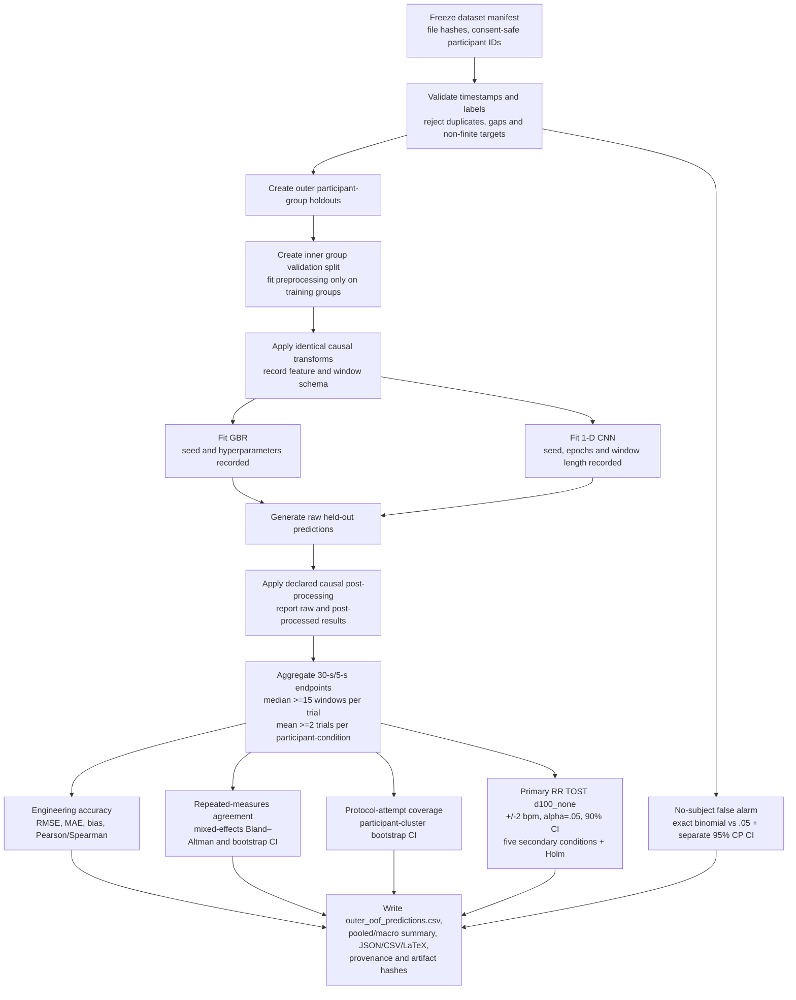

# Radar Vital v16.5.12 Hardware–Software Feedback Loop

This document is the canonical source for the system-process figures used by
the repository and manuscript. It describes the shipped v16.5.12 product while
keeping the wire protocol identity explicit: firmware v16.5.12 emits the frozen
v15.2 CSV contract (222 columns, including the three fields introduced in
v16.4 at columns 220–222).

## Documentation rule

Update this file in the same commit whenever a change affects hardware,
firmware scheduling, protocol or quality flags, capture/parsing/alignment,
feature construction, dataset grouping, model training/inference, validity or
post-processing policy, statistical analysis units or decisions, artifact
promotion, predictions, dashboard interpretation, manuscript evidence, or any
version/protocol label.

The figures are executable documentation:

```bash
npm run docs:export-feedback-loop
npm run docs:export-feedback-loop -- --check
```

The export writes Mermaid sources and LaTeX caption snippets to
`build/manuscript-figures/`. Render the `.mmd` files to SVG or PDF with a
Mermaid-compatible renderer, then include the result in the manuscript. The
figure IDs and captions below are stable integration points.

Release rule: every product-affecting pull request increments exactly one
semantic-version patch or minor step. The firmware filename, trainer/API
identity, Angular/PWA identity, package locks, native packaging metadata,
controlled-document register, and manuscript figure labels are updated in the
same change. Stable schema identities (including `rvt-session-manifest-v1` and
the predeclared statistical-plan ID) are not renamed for a release-only bump.

```mermaid
flowchart LR
    subject["Participant and reference device"]
    radar["MR60BHA2 60 GHz radar"]
    mcu["XIAO ESP32-C6<br/>firmware v16.5.12"]
    serial["USB serial<br/>v15.2 CSV, 222 columns"]
    capture["Python trainer v16.5.12<br/>capture and quality ledger"]
    dataset["Immutable session artifacts<br/>participant, session, timestamps"]
    features["Causal feature pipeline<br/>train-only fit and schema hash"]
    split["Recorded group split manifest<br/>outer participant holdout"]
    gbr["Gradient boosting regression<br/>default model family"]
    cnn["1-D CNN<br/>optional experimental family"]
    stats["Shared statistical report<br/>RMSE/MAE, repeated-measures agreement,<br/>coverage CI, TOST and exact proportions"]
    evidence["Hashed evidence bundle<br/>JSON, CSV, plots and LaTeX tables"]
    registry["Signed model artifact and manifest<br/>family, split, seed, hashes"]
    api["Trainer prediction and report API"]
    ui["Angular dashboard v16.6.1<br/>provenance, status and comparison"]
    manuscript["LaTeX manuscript<br/>figures, methods and results"]
    protocol["Reviewed protocol decision<br/>acquisition, firmware and software changes"]
    operator["Operator action<br/>placement, capture quality, retraining"]

    subject --> radar --> mcu --> serial --> capture --> dataset --> features --> split
    split --> gbr --> stats
    split --> cnn --> stats
    stats --> evidence --> registry --> api --> ui --> operator
    evidence --> manuscript --> protocol
    operator -. "feedback for the next recorded session" .-> subject
    capture -. "hardware and protocol diagnostics" .-> ui
    protocol -. "approved acquisition change" .-> subject
    protocol -. "approved firmware change" .-> mcu
    protocol -. "approved software/analysis change" .-> features
```

<!-- figure:hardware-software-feedback-loop -->


Manuscript caption (`hardware-software-feedback-loop`):
“Radar Vital v16.5.12 hardware–software feedback loop. The ESP32-C6 firmware
streams the frozen v15.2/222-column serial contract to the Python trainer.
Immutable, participant-grouped session artifacts feed one causal preprocessing
and holdout manifest shared by gradient boosting and the experimental 1-D CNN.
One hashed statistical evidence bundle drives trainer reports, dashboard
feedback, LaTeX figures/tables, and reviewed changes to the next hardware,
firmware, software, or acquisition cycle.”

## Reproducible dual-model experiment process

<!-- figure:gbr-cnn-reproducibility-process -->


Manuscript caption (`gbr-cnn-reproducibility-process`):
“Reproducible comparison process for gradient boosting regression and the
experimental 1-D CNN. Both families receive identical participant-grouped
outer folds and training-fitted causal transforms. Raw and declared
post-processed held-out predictions are retained, then aggregated by trial and
participant-condition. Accuracy, repeated-measures agreement, clustered
coverage, predeclared primary/secondary equivalence, and exact false-alarm evidence are exported
from the same outer-OOF prediction and study manifests.”

## Required reproducibility fields

Every training/evaluation run must record these fields in machine-readable
form. A missing required field makes the result exploratory rather than
manuscript-ready.

| Area | Required fields |
|---|---|
| Product and acquisition | `run_product_version`; trainer, dashboard and firmware versions; study protocol ID; study-session schema version; observed column width; capture-quality summary |
| Dataset provenance | dataset/run ID; source file hashes; consent-safe participant ID; session ID; timestamp range; target availability |
| Split provenance | outer and inner group assignments; grouping key; random seed; excluded rows/windows with reasons |
| Transform provenance | ordered feature names; feature-schema hash; imputation/scaling parameters fitted on training data only; causal window length and gap policy |
| Model provenance | family (`gradient_boosting` or `cnn_1d`); target; library versions; complete hyperparameters; training seed; early-stopping evidence |
| Prediction provenance | row/window identity; raw prediction; post-processed prediction; abstention/OOD status; reference value |
| Statistical analysis plan | `analysis_plan_id`; canonical `analysis_plan_sha256`; analysis unit; error orientation (`estimate - reference`); condition hierarchy; eligibility/aggregation rules; alpha; equivalence bounds; bootstrap seed/replicates; power assumptions |
| Statistical outputs | sample/participant/trial/session counts; RMSE; MAE; bias; Pearson/Spearman; repeated-measures limits of agreement; coverage and confidence intervals; exact false-alarm result; equivalence margins; both TOST statistics/p-values and decision |
| Artifact integrity | model/config/report hashes; creation time; source commit; promotion/rollback state |

## Participant and thesis-condition session contract

Every new real or simulated study session belongs to exactly one pseudonymous
participant profile and one trial. Participant profiles are separate from
demographic/physiology subject profiles and must never contain names in model
exports. Once capture starts, the participant and trial assignment is
immutable.

The session manifest must contain:

`participant_id`, `trial_id`, `condition_id`, `distance_m`, `barrier_type`,
`trial_number`, `planned_duration_s`, `product_version`, `trainer_version`,
`dashboard_version`, `firmware_expected`, `firmware_observed`,
`serial_protocol_version`, `serial_column_count`, `source_commit`,
`model_family`, `model_bundle_id`, `logical_trial_id`, `attempt_id`, and
`attempt_type`.

The v16.5.12 capture rule is that `capture_provenance` is written once at
allocation and never rewritten by analysis. Re-analysis appends an
`analysis_runs[]` record containing the current source commit, feature-schema
hash, and input-file hashes. Each capture also owns an append-only
`protocol_attempt.json` state ledger. The ledger must retain `allocated`,
`collecting`, and one terminal state (`completed`, `stopped`, `failed_start`,
`aborted`, `invalid`, or `no_output`). A standalone `no_subject` attempt is
recorded in `protocol_attempts.json`; it is never inferred from missing OOF
rows. The operator-protected completion matrix uses these ledgers to report
all 18 participant/configuration repetitions and the predeclared 72 no-subject
attempt denominator.

The software accepts a validated distance domain of 0.5–1.0 m so bench and
future protocol work can be represented without free-text labels. The attached
2026-07-22 proposal remains the confirmatory authority: 0.6, 0.8, and 1.0 m,
each without a barrier and with one nominal 3-mm cardboard panel, three 150-s
trials per participant/configuration, 40 recruited participants, and at least
38 protocol-complete participants targeted. Changing those confirmatory levels
requires a protocol/manuscript revision and release increment; it must not be
done by silently editing session metadata.

Participant-grouped outer folds are mandatory for confirmatory GBR/1-D CNN
comparison. Sessions marked `legacy_unassigned`, participant-reassigned,
outside the frozen condition set, or lacking release/protocol provenance remain
exploratory and cannot enter confirmatory statistics.

Research artifacts must not overload release, plan, protocol, and schema
identity. Every outer-OOF row, confirmatory-run manifest, statistics-provenance
record, and confirmatory report carries these distinct fields:
`run_product_version`, `analysis_plan_id`, `analysis_plan_sha256`,
`study_protocol_id`, and `study_session_schema_version`. The plan's
`effective_product_version` records the controlled plan lineage; it is not a
requirement that later software runs pretend to use that older product
version. The canonical plan digest binds the exact parsed plan content, so a
plan edit requires new provenance even when its identifier is accidentally
left unchanged.

The operator-facing objective contract is served by
`GET /api/study/objectives` and is rendered in the Angular participant setup.
The locked protocol is read or written through `/api/study/protocol`, while
`/api/study/schedule?participant_id=P-NNN` returns the persisted deterministic
randomization for that participant. This binds the four approved manuscript
objectives to their evidence paths: primary RR TOST at `d100_none`, exploratory
unobstructed temperature agreement, the 72-trial no-subject false-alarm
denominator, and exploratory HR agreement across the six configurations.
Reference observations are append-only at
`/api/sessions/<id>/references`; RR requires two locked observer readings before
`/references/rr-adjudication` can create a final value. Analysis requests and
objective reports retain job, model-family, and release provenance and never
report a pass before a completed analysis exists. The completion matrix,
withdrawal history, attempt ledger, model training/prediction status, and
session tags are all reachable from the same frontend API surface, including
the sandbox adapter. The backend's durable logical-trial reservation is
separate from HTTP idempotency, so two clients cannot allocate one
participant/condition/repetition concurrently. The static
`tests/test_frontend_backend_api_contract.py` check prevents a Python route
from being added without a corresponding dashboard binding.

## Statistical interpretation rule

The registered statistical plan and `RVT-STA-001` remain `draft`. Draft
requirements may drive implementation and test preparation, but they cannot
authorize confirmatory evaluation, recruitment, collection, exclusion, or a
manuscript claim. Confirmatory execution remains blocked until the named
research lead and quality manager record approval and all applicable
advisor/ethics/REC conditions are satisfied.

- Define TOST equivalence margins before training and justify them in the
  protocol or manuscript; never derive them from the observed test results.
- The current manuscript plan uses RR bounds of ±2 breaths/minute, alpha 0.05,
  and a 90% confidence interval. Store these as a versioned analysis-plan input,
  not as an unchangeable implementation constant.
- Use the versioned `quality/statistical-analysis-plan.json`: aggregate 30-second
  windows at 5-second stride, retain a trial only when at least 15 windows are
  valid, then retain a participant-condition only when at least two trials are
  valid. The primary RR TOST is 1.0 m/no-cardboard (+/-2 breaths/minute,
  alpha=0.05, 90% CI); the other five protocol conditions are secondary and
  use Holm adjustment. Fewer than 19 independent primary participant estimates
  is inconclusive, never a pass.
- Use repeated-measures Bland–Altman/mixed-effects agreement rather than
  naïve row-wise `bias ± 1.96 SD`, and bootstrap complete participants for
  interval estimates.
- For no-subject false alarms, use the predeclared exact binomial test and a
  separate two-sided Clopper–Pearson interval. Coverage denominators include
  every eligible protocol-attempted trial, including non-output.
- Evaluate paired errors on the same held-out rows/windows for GBR and 1-D CNN.
- Report participant/session macro summaries and pooled predictions; do not
  present a fold average as if it were a pooled estimate.
- Retain raw predictions. Any smoothing, clipping, slew limiting, or abstention
  is a separate causal post-processing result with its own coverage.
- Do not claim equivalence merely because a conventional difference test is
  non-significant. Equivalence requires both one-sided TOST hypotheses to pass
  at the declared alpha.
- The CNN remains a host-side experimental option unless a separate, measured
  TinyML deployment and hardware acceptance plan is completed. The diagram
  must not imply that the current firmware performs CNN inference.

## Analysis-job and evidence-promotion rule

The dashboard's Model Lab submits an objective and model family, but the
trainer owns objective classification and cohort selection. Participant capture
is model-agnostic (`model_family: "none"`) unless a verified inference bundle is
active; model selection therefore cannot create separate, confounded cohorts.
The durable analysis-job index is recoverable after a browser refresh, and the
frontend exposes the job's progress, phase, cohort selection, statistics state,
and error/last-line evidence. Confirmatory RR
analysis discovers the complete manifest-backed participant cohort, requires
at least 38 independent participants with the six conditions and three trials,
forces participant-disjoint LOSO outer folds, and writes a hashed run manifest.
The durable job is bounded to one worker, survives refresh through its JSON
record, supports cancellation, and exposes `queued`, `running`, `blocked`,
`failed`, and `completed` states. A completed trainer run is still only
descriptive until the approved statistics CLI produces a validated report;
manifest paths, input/OOF/model hashes, source commit, protocol identity, and
statistical status must all agree before an objective report can be `ready`.

No-subject false-alarm rows are separated into attempted and qualified
denominators. The locked protocol requires exactly 72 planned 150-second trials
and frozen firmware, artifact-rule, and alert-threshold identities. A qualified
row requires a completed terminal event, a unique session-backed no-subject
manifest, exactly 150 seconds of corroborated capture time, matching expected
and observed firmware plus capture/release provenance, the frozen configuration
hash, and an explicit trial-level any-alert value of zero or one. Exactly 72
unique qualified trials with non-overlapping capture intervals produce the Objective 3 report
directly from the ledger: observed proportion, a separate two-sided 95%
Clopper–Pearson interval, and the one-sided exact binomial test of
`H0: p >= 0.05` against `H1: p < 0.05`. Missing SciPy evidence blocks the report
instead of fabricating a result. The UI therefore cannot turn a button click or
a missing OOF row into one of the 72 confirmatory control trials.

## Manuscript integration map

| Repository output | Manuscript destination |
|---|---|
| Hardware–software feedback-loop figure | System architecture / methodology |
| GBR–CNN reproducibility-process figure | Model development and validation methodology |
| Dataset and split manifest | Dataset description and reproducibility appendix |
| Fold and pooled statistical tables | Results chapter |
| TOST, repeated-measures agreement, coverage, and exact false-alarm evidence | Statistical analysis, results, and discussion |
| Artifact/version hashes | Implementation appendix |

The local manuscript may copy the exported figures and generated table
snippets, but repository code and this canonical document remain the source of
truth. Local thesis files are never pushed unless the user explicitly changes
that rule.
